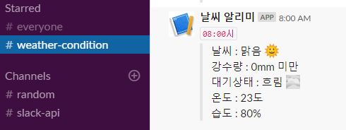

<style>
img.aligncenter{display:block;margin:0 auto}
</style>

{:.aligncenter}

## API params
```bash
weather/config/slak/api-key.json
```

## How to get an API Parameters?
```json
{
	"slackApiKey":"API키 생성(https://api.slack.com/custom-integrations/legacy-tokens) 참조",
	"channelId": "슬랙 채널 명 우클릭 -> 링크 주소 복사하여 나오는 문자열",
	"weatherApiKey": "공공데이터 홈페이지에 사용 신청한 API 키"
}
```

# Error
```bash
- python v2.7 버전 설치
npm install --python=python2.7
npm config set python python2.7

npm install -g node-gyp
npm install -g --production windows-build-tools
npm install iconv
```

# Run
```bash
npm start
http://localhost:8080
```

